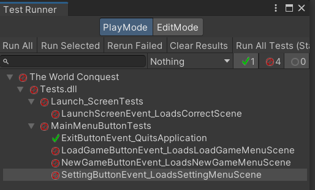

# Sprint 1 - Main Menu Design & Document update

## Summary Data

* Team Number: 27
* Sprint Technical Lead(s): Max Wang
* Sprint Start Date: 2024-02-22
* Sprint End Date: 2024-02-28

## Individual Key Contributions:

|  Team Member   | Key Contribution(s)  |
|  :----         | :----                |
| Max Wang       | 1. Coding for Main Menu; 2. UI design; 3. sprint document |
| Tao Yiwen      | 1. Main Menu UI implement; 2. UI design |
| Wu Tong        | 1. Test Ver0.0.4 2.Code error modification |
| Sun Weiyi      | 1. High Level Document update |
| Song Zhenmao   | 1. Standard document update |
| Zhang Yaowen   | 1. Low Level Document update |

## User Stories 
***Note user stories, the more detailed the better, without using technical language or abstracting the user’s needs***

No user story for this sprint.

## Requirement analysis / Task Cards
***Analyze user stories, split them into different needs, and then decompose them into task cards***

### Requirement analysis

* Main menu
    * Create by 3D scene.
    * A piece of vintage parchment paper on a wooden table.
    * kerosene lamp on vintage parchment paper.
    * sextant, knife, inkwell etc...
    * The text and shape in vintage parchment paper will be the **button** of main menu.
    * Different setting function will be allocated in one scene.

* Button UI
    * Four Square button for language setting; Mute audio; credits; Game Setting.
    * Every button has a image on it instead of text.
    * Those button will be placed on the buttom-right of the main menu.

* Dice model
    * Design more than 10 kind of dice model. Use wooden materials.(Already mentioned in the library)
    * **NO NEED TO IMPLEMENT IT IN THE GAME**

* Game Frame
    * Design a **High scalability** frame for this game.
    * Implement some algorithm. Replace the real function to Debug log.

* Setting scene
    * No implement in this sprint

### Task Card

* Sprint document compose
    * Fill common items by `Max Wang`
    * Story/Requirement analysis by `Max Wang`
    * Design by `Max Wang`,`Tao Yiwen`
    * Test by ``
    * Summary by ``

* Main menu scene 
    * design by `Max Wang`,`Tao Yiwen`

* UI implement for Main menu
    * by `Tao Yiwen`

* Small Button UI 
    * design by `Max Wang`,`Tao Yiwen`
    * Implement by `Tao Yiwen`

* Dice model
    * by `Tao Yiwen`

* C# script coding for Main menu button
    * By `Max Wang`

* Project structure build
    * By `Max Wang`

* Algorithm implement
    * By `Max Wang`

* Code refactor
    * By `Max Wang`

* Setting scene and langurage scene
    * By `Max Wang`

* Low level document update
    * By `Zhang Yaowen`

* High level document update
    * By `Sun Weiyi`

* Standard document update
    * By `Song Zhenmao`

## Design

## Test plan and evidence of testing
  * Test class
    1. Launch_Screen
    2. Main_Menu_Button

  * Evidence of testing
    1. See details in Defect Report 001
    2. 
    

## Summary of sprint
    We have a good start, a clear division of labor and a good project structure, but from the perspective of work progress, our work efficiency is not very high. Hope we can guarantee quality and efficiency in future work.

